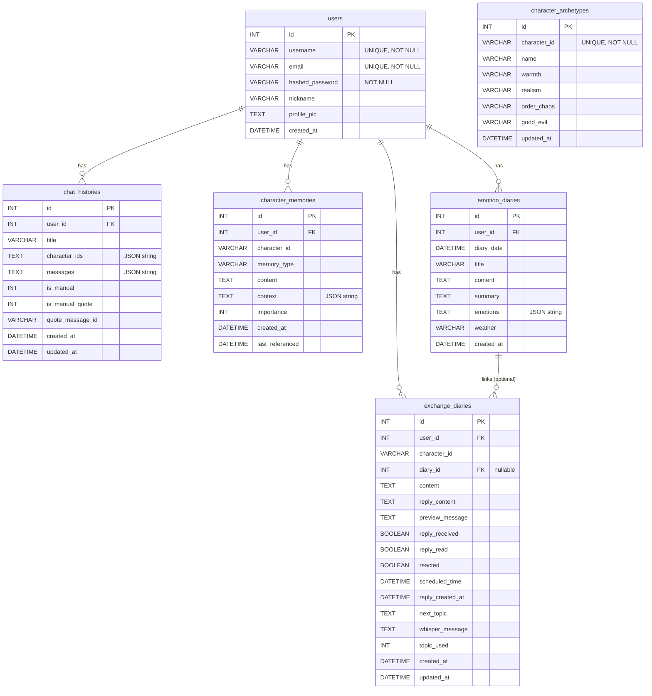

# 🎭 IntoDrama - 드라마 캐릭터 AI 챗봇

> ✨ **좋아하는 드라마 캐릭터와 실제로 대화해보세요!**  
> **드라마가 끝나도 이야기는 계속됩니다** 🎬

**IntoDrama**는 드라마 속 캐릭터들과 **실제로 대화**할 수 있는 AI 챗봇 플랫폼입니다. 

드라마가 끝나도 아쉬웠던 그 순간들을 다시 살려보세요. 좋아하는 캐릭터와 깊이 있는 대화를 나누고, 손편지를 주고받으며, 함께 토론하고, 감정을 나눌 수 있습니다. 각 드라마의 명대사를 **수작업으로 모두 수집**하여 캐릭터의 고유한 말투와 성격을 정확히 재현했으며, 프롬프트 기반 방식으로 저작권 문제 없이 안전하게 구현했습니다.

이 프로젝트는 **나중에 다른 캐릭터 데이터만 추가하면 누구나 자신만의 챗봇을 만들 수 있는 프레임워크 성격**을 가지고 있습니다.

**지금 바로 시작해보세요!** 당신만의 드라마 스토리를 만들어가세요. ✨

## 🎯 비전

현재는 드라마 캐릭터 중심이지만, 향후 **"역사적 인물(교육용)"**, **"웹툰/애니메이션(서브컬처)"**, **"심리상담용 가상 에이전트"** 등으로 확장 가능한 플랫폼을 지향합니다.

🌐 **웹앱(Web App)**: 데스크톱 브라우저와 모바일 브라우저 모두에서 사용 가능하며, 모바일에서는 홈 화면에 추가하여 앱처럼 사용할 수 있습니다. (감정 기반 UI 변화 시 조명효과가 있어 웹 사용 권장) 

### 🎁 **이런 것들을 할 수 있어요!**

- 💬 **1:1 대화 & 멀티채팅**: 좋아하는 캐릭터와 깊이 있는 대화를 나누거나, 2명의 캐릭터와 동시에 대화할 수 있습니다
- 🗣️ **토론 모드**: 두 캐릭터가 특정 주제에 대해 토론하는 모습을 관찰하고 직접 참여할 수 있습니다
- ✉️ **교환일기 (손편지)**: 일기를 작성하면 드라마 속 캐릭터가 직접 답장 편지를 보내줍니다. 마치 진짜 친구와 편지를 주고받는 것 같은 경험!
- 📊 **대화 통계 & 심리 리포트**: 대화 내용을 분석하여 주간 통계와 심리 리포트를 제공합니다
- 📝 **감정 일기**: AI가 대화 내용을 분석하여 감정 일기를 자동으로 생성해줍니다
- 🎵 **음악 추천**: 대화 내용을 바탕으로 감정에 맞는 음악을 추천받을 수 있습니다
- 🗺️ **캐릭터 성향 지도**: 캐릭터들의 성향을 2D 지도로 시각화하여 비교할 수 있습니다
- 💾 **대사 저장 & 이미지 공유**: 마음에 드는 대사를 저장하고 예쁜 이미지로 만들어 공유할 수 있습니다
- 🎨 **감정 기반 UI**: 대화 내용에 따라 배경색과 UI가 자동으로 변화하여 몰입감을 높입니다

## 🎥 데모 영상

- **전체 데모 영상**
  - [](https://youtube.com/watch?v=vxY2TymhWEs)

- **감정 기반 UI 데모 영상**
  - [](https://youtube.com/watch?v=MmrIpxyqzcE)

---

## 🌟 핵심 기능 (Core Features)

### 1) 지능형 페르소나 엔진 (High-Fidelity Persona Engine)

- **수작업 명대사 데이터셋**: 드라마 대본/명대사에서 직접 수집한 데이터를 기반으로(**personas.py파일, 코드 약 2000줄**) 말투, 어미, 가치관을 설계해 캐릭터 일치도를 극대화했습니다.
- **프롬프트 기반 아키텍처**: 별도의 파인튜닝 없이 고도화된 프롬프트 엔지니어링을 적용하여, 저작권 리스크를 줄이면서 유연하게 캐릭터를 구현합니다.
- **장기 기억 시스템 (Memory Management)**: 사용자와의 대화를 감정/선호도/관계성 등으로 분류해 기억하고, 시간이 흐를수록 개인화된 대화 경험을 제공합니다.

### 2) 다차원 대화 인터랙션

- **멀티채팅 및 토론 모드**: 캐릭터 간 관계성을 반영한 3자 대화(사용자+2캐릭터), 특정 주제에 대한 AI 캐릭터 간 토론을 지원합니다.
- **교환일기(손편지)**: 사용자의 일기에 대해 캐릭터가 페르소나를 유지하며 답장을 보내는 비동기 정서 교감 기능을 제공합니다.
- **감정 기반 동적 UI**: 실시간 문맥 분석을 통해 배경색/애니메이션/말풍선 스타일이 자동으로 변화하여 몰입감을 높입니다.

### 3) 데이터 분석 및 심리 리포트

- **AI 심리 분석**: 대화 데이터를 분석하여 로맨스/위로/갈등 지수 등을 산출하고 주간 리캡 및 심리 리포트를 생성합니다.
- **캐릭터 성향 지도**: 캐릭터들을 ‘따뜻함/차가움’, ‘현실적/이상적’ 축으로 시각화하여 성향을 한눈에 비교할 수 있습니다.

---

## 📌 상세 기능 설명

### 🧭 기능 목차

- **대화(채팅)**: 1:1 / 1:2 멀티채팅 / 토론 모드 / 대화 저장·관리 / 대사 저장
- **일기**: 감정 일기(자동/키워드/직접 작성) / 교환일기(손편지, 예약 답장)
- **분석/리포트**: 주간 통계 / 주간 리캡 / 심리 리포트 / 감정 타임라인
- **UX/도구**: 감정 기반 UI / 타이핑 효과 / 메시지 캡처·공유 / 소설 형식 변환 / 한국어 조사 처리 / 프로필 / 음성 입력
- **기타**: 캐릭터 성향 지도 / 음악 추천

### 💬 대화 기능

#### 공통 기능 (1:1 대화 및 1:2 멀티채팅 공통)

- **실시간 날짜·시간대 인식**: 캐릭터가 실제 현재 날짜와 시간대를 인식하여 자연스럽게 반응합니다 (1:1 대화 및 1:2 멀티채팅 모두 지원)
  - 현재 날짜(년/월/일)와 시간대(아침/오후/저녁/밤), 요일을 자동으로 감지합니다
  - 시간대에 맞는 말투와 분위기로 자연스럽게 대화합니다 (예: 아침에는 상쾌한 인사, 밤에는 조용한 분위기)
  - 사용자가 구체적으로 시간을 물어볼 때만 정확한 시간을 알려줍니다
  - 시간대를 직접적으로 언급하지 않고 대화 속에 자연스럽게 녹여냅니다
- **페르소나 기반 대화**: 각 캐릭터의 고유한 성격, 말투, 배경 스토리를 반영한 자연스러운 대화
- **🎬 직접 수집한 드라마 명대사 기반**: 
  - `personas.py`의 모든 캐릭터 데이터(약 2000줄)는 각 드라마의 **실제 명대사를 직접 수집하여 수작업으로 작성**되었습니다
  - 인터넷에서 각 드라마의 명대사를 하나하나 수집하여 캐릭터의 고유한 말투와 감성을 정확히 재현했습니다
  - 수집한 명대사를 프롬프트 형식으로 구성하여, 캐릭터의 성격과 말투를 자연스럽게 학습하도록 설계했습니다
  - **프롬프트 기반 방식**: 파인튜닝이나 임베딩 패턴 학습 없이, 오직 프롬프트를 통해 캐릭터의 스타일만 참고하는 구조로 구현했습니다
- **행동 표현 지원**: 대화 입력 시 행동과 대사를 구분하여 입력 가능 (예: "(웃으며) 안녕하세요", "(한숨을 쉬며) 그렇구나")
- **실시간 타이핑 효과**: AI 응답이 타이핑되는 것처럼 표시되어 생동감 있는 대화 경험 제공
- **캐릭터 기억 시스템**: 이전 대화 내용을 기억하고 다음 대화에 반영하여 장기적인 관계 형성
- **대화 맥락 유지**: 대화 흐름을 자연스럽게 이어가며 캐릭터의 일관성 있는 반응 제공

<details>
<summary><strong>1:1 대화</strong></summary>

- **단일 캐릭터와의 개인 대화**: 한 명의 드라마 캐릭터와 깊이 있는 1:1 대화를 나눌 수 있습니다

</details>

<details>
<summary><strong>1:2 멀티채팅</strong></summary>

- **2명의 캐릭터와 동시 대화**: 사용자는 최대 2명의 캐릭터와 동시에 대화할 수 있습니다 (1:1 또는 1:2 대화만 지원)
- **캐릭터 간 상호작용**: 두 캐릭터가 서로 대화하며 사용자와도 자연스럽게 소통하는 3자 대화 형식
- **관계 기반 대화**: 캐릭터들 간의 드라마 내 관계를 반영한 자연스러운 상호작용
- **캐릭터별 구분**: 각 메시지에 캐릭터 이름이 표시되어 누가 말하는지 명확히 구분
- **대화 흐름 관리**: 여러 캐릭터가 참여하는 복잡한 대화 상황도 자연스럽게 처리
- **시각적 구분**: 1:2 대화 시 내 대화 보관함에서 두 캐릭터의 프로필 사진이 대각선으로 겹쳐 표시

</details>

<details>
<summary><strong>토론 모드</strong></summary>

- **2명의 캐릭터 토론**: 정확히 2명의 캐릭터가 선택된 상태에서 특정 주제에 대해 토론을 진행합니다
- **토론 주제 선택**: 미리 준비된 토론 주제 중 선택하거나 직접 주제를 입력할 수 있습니다
  - **주제 색상 구분**: 무거운 주제와 가벼운 주제가 색상으로 구분되어 표시됩니다
  - **오늘의 질문 추천**: "오늘의 질문 추천" 버튼을 통해 랜덤으로 주제를 선택할 수 있습니다
- **토론 스타일**: 공격형, 차분형, 균형형 등 다양한 토론 스타일을 선택할 수 있습니다
- **라운드별 진행**: 토론이 여러 라운드로 나뉘어 진행되며, 각 라운드마다 캐릭터들이 의견을 제시합니다
- **사용자 개입 기능**: 토론 중간에 사용자가 직접 의견을 제시하고 토론에 참여할 수 있습니다
  - **라운드 3 이상**: 3라운드부터 사용자가 토론에 개입할 수 있는 패널이 표시됩니다
  - **입장 선택**: 미리 준비된 입장 선택지 중 하나를 선택하거나 직접 의견을 입력할 수 있습니다
  - **자동 진행**: 사용자가 개입하면 자동으로 다음 라운드로 진행됩니다
- **시각적 배치**: 각 캐릭터가 화면 왼쪽/오른쪽에 배치되어 토론의 대립 구조를 시각적으로 표현
- **토론 요약**: 토론 종료 시 각 라운드의 요약과 전체 토론 내용을 정리하여 제공
- **감상평 제공**: 토론 종료 후 각 캐릭터가 자신의 입장과 감상을 정리한 메시지를 제공
- **일반 채팅 전환**: 토론 모드 종료 후 일반 채팅으로 자연스럽게 전환 가능
- **토론 히스토리 제외**: 토론 내용은 일반 대화 히스토리에서 제외되어 페르소나에 영향을 주지 않습니다

</details>

<details>
<summary><strong>대화 저장 및 관리</strong></summary>

- **대화 보관함 (내 대화 보관함)**
  - 사용자가 직접 "서버에 저장" 버튼을 눌러 저장한 전체 대화만 표시됩니다
  - 필터링 조건: `is_manual=1 AND is_manual_quote=0` (사용자가 직접 저장한 대화만)
  - 자동 저장된 대화(`is_manual=0`)나 대사 저장으로 인한 자동 저장(`is_manual_quote=1`)은 대화 보관함에 표시되지 않습니다
  - 대화 제목을 직접 입력하거나 자동 생성된 제목으로 저장 가능
  - 저장된 대화 목록에서 상대 시간 표시 (방금 전, n일 전, n주 전 등)
  - 저장된 대화를 클릭하여 언제든지 다시 불러올 수 있습니다
  - 대화 삭제 기능으로 불필요한 대화를 정리할 수 있습니다
  - 1:1 대화는 단일 프로필 사진, 1:2 대화는 두 캐릭터의 프로필 사진이 대각선으로 겹쳐 표시됩니다
  - 최신순 정렬: 저장된 대화는 최신순으로 정렬되어 표시됩니다

- **자동 저장 시스템**
  - 로그인한 사용자의 경우 모든 대화가 자동으로 서버에 저장됩니다 (`is_manual=0`)
  - 자동 저장된 대화는 통계 및 분석에 활용되지만 대화 보관함에는 표시되지 않습니다
  - 대사 저장(하트 클릭) 시 해당 대사와 전체 대화가 자동으로 서버에 저장됩니다
    - 단일 대사 저장: `is_manual=0, is_manual_quote=1` (대화 보관함에 표시 안 됨)
    - 전체 대화 자동 저장: `is_manual=0, is_manual_quote=0` (대화 보관함에 표시 안 됨)
  - 대사 저장으로 인한 자동 저장은 대화 흐름 추적을 위해 서버에만 저장되며, 대화 보관함에는 표시되지 않습니다

- **저장된 대사 목록**
  - 채팅방에서 상대 말풍선을 두 번 더블클릭하면 하트 표시가 되고 대사가 자동 저장됩니다
  - 저장된 대사는 별도의 "저장된 대사 목록" 페이지에서 관리됩니다
  - 저장된 대사는 대화 보관함에 나타나지 않으며, 오직 저장된 대사 목록에서만 확인 가능합니다
  - 각 저장된 대사에는 해당 대사가 포함된 전체 대화로 이동할 수 있는 "대화 흐름 추적하기" 버튼이 제공됩니다
  - 저장된 대사에는 캐릭터 이름, 대화 날짜, 대사 내용이 표시됩니다
  - **대사 이미지 저장**: 저장된 대사 목록에서 원하는 대사를 선택하여 아름다운 이미지로 저장할 수 있습니다
    - HTML2Canvas를 활용하여 고해상도의 이미지를 생성합니다
    - 캐릭터 프로필 사진, 대사 내용, 날짜 정보가 포함된 디자인된 이미지로 저장됩니다
    - 저장된 이미지는 SNS에 공유하거나 갤러리에 보관하여 오랫동안 소장할 수 있습니다
  - **명대사 이미지 저장**: 대화 중 마음에 드는 명대사를 실시간으로 이미지로 저장할 수 있습니다
    - 대화 화면에서 원하는 메시지를 선택하여 바로 이미지로 변환 가능합니다
    - 명대사 이미지는 캐릭터의 프로필과 함께 예쁘게 디자인되어 저장됩니다

- **대화 흐름 추적하기**
  - 저장된 대사 목록에서 "대화 흐름 추적하기" 버튼을 클릭하면 해당 대사가 포함된 전체 대화가 표시됩니다
  - 저장된 대사는 노란색 글로우 효과로 하이라이트되어 쉽게 찾을 수 있습니다
  - 대사 저장(하트 클릭) 시 자동으로 전체 대화가 서버에 저장되어 나중에 추적할 수 있습니다
  - 대사 저장으로 인한 자동 저장은 대화 보관함에 표시되지 않으며, 서버에만 저장되어 대화 흐름 추적에만 사용됩니다
  - 대화의 전체 맥락을 파악하며 저장된 대사가 어떤 상황에서 나온 것인지 확인 가능합니다

</details>

### 📊 통계 및 분석

<details>
<summary><strong>주간 통계</strong></summary>

- **이번주 대화 요약**: 현재 주(월요일부터 오늘까지)의 대화 활동을 한눈에 확인
- **캐릭터별 활동량**: 이번주에 가장 많이 대화한 캐릭터 TOP 3를 순위와 함께 표시
- **상세 통계 정보**: 각 캐릭터별 대화 횟수, 메시지 수, 대화 시간 등 구체적인 수치 제공
- **시각적 표현**: 그래프와 차트를 통해 데이터를 직관적으로 이해할 수 있도록 시각화
- **랭킹 시스템**: 1위, 2위, 3위 캐릭터를 뱃지와 함께 표시하여 한눈에 파악 가능

</details>

<details>
<summary><strong>주간 리캡</strong></summary>

- **월별 주간 대화 요약**: 6개월간의 대화 기록을 월별로 나누어 확인할 수 있습니다
- **주별 활동 시각화**: 각 주의 대화 활동량을 시각적으로 표현하여 패턴 파악 가능
- **캐릭터 랭킹**: 해당 주에 가장 많이 대화한 캐릭터 TOP 3를 순위와 함께 표시
- **현재 주 하이라이트**: 이번주 대화 활동을 특별히 강조하여 표시
- **"이번주" 뱃지**: 현재 주를 명확히 구분할 수 있는 뱃지 제공
- **과거 데이터 탐색**: 최근 6개월간의 대화 패턴을 시간순으로 탐색 가능

</details>

<details>
<summary><strong>심리 리포트</strong></summary>

- **AI 기반 심리 분석**: 대화 내용을 AI가 분석하여 사용자의 심리 상태를 파악합니다
- **감정 상태 분석**: 대화에서 드러나는 감정 상태를 분석하고 시각화합니다
  - **로맨스 점수**: 대화에서 드러나는 로맨틱한 감정의 강도를 분석합니다
  - **위로 점수**: 위로나 공감이 필요한 감정의 강도를 분석합니다
  - **갈등 점수**: 갈등이나 스트레스가 있는 감정의 강도를 분석합니다
- **주요 감정 결정**: 분석된 감정 점수를 바탕으로 주요 감정(dominant mood)을 결정합니다
- **키워드 분석**: 대화에서 자주 사용된 키워드를 추출하여 감정 패턴을 파악합니다
- **말투 분석**: 사용자의 말투 스타일을 분석하여 대화 패턴을 이해합니다
- **관계 패턴 분석**: 캐릭터와의 관계 패턴, 대화 스타일, 선호도 등을 분석합니다
- **에피소드별 리포트**: 특정 대화 세션을 에피소드로 저장하고 해당 에피소드의 리포트를 생성합니다
- **리포트 저장 및 관리**: 생성된 리포트를 저장하여 나중에 다시 확인할 수 있습니다
- **리포트 이미지 생성**: 리포트를 이미지로 변환하여 저장하거나 공유할 수 있습니다
- **감정 타임라인**: 대화 시간순으로 감정 변화를 시각화하여 타임라인으로 확인할 수 있습니다
- **인사이트 제공**: 대화 패턴을 통해 사용자의 심리적 특성과 관계 형성 방식을 인사이트로 제공

</details>

### 📝 일기 기능 (마음 기록 노트)

<details>
<summary><strong>감정 일기 자동 생성</strong></summary>

- **AI 기반 일기 생성**: 대화 내용을 AI가 분석하여 감정 일기를 자동으로 생성합니다
- **생성 방식 구분**:
  - **메인 화면에서 일기 생성**: 메인 화면의 "마음 기록 노트"에서 일기를 생성할 경우, **키워드 기반 생성만 가능**합니다. 사용자가 직접 키워드를 입력하여 AI가 일기를 생성합니다.
  - **채팅방에서 일기 생성**: 채팅방 내에서 일기 기능을 사용할 경우, **대화 기반 생성 또는 키워드 기반 생성** 중 선택할 수 있습니다. 현재 대화 세션의 메시지를 분석하여 일기를 생성하거나, 키워드를 입력하여 일기를 생성할 수 있습니다.
- **키워드 기반 생성**: 사용자가 직접 키워드를 입력하여 일기를 생성할 수 있습니다
- **대화 기반 생성**: 현재 대화 세션의 메시지를 분석하여 일기를 생성합니다 (채팅방에서만 사용 가능)
- **직접 작성**: AI 생성 없이 사용자가 직접 일기를 작성할 수도 있습니다
- **감정 상태 반영**: 대화에서 드러난 사용자의 감정 상태를 일기 내용에 자연스럽게 반영
- **감정 태그**: 일기에 감정 태그(기쁨, 슬픔, 화남, 불안, 평온 등)를 추가할 수 있습니다
- **대화 경험 정리**: 캐릭터와의 대화 경험을 일기 형식으로 정리하여 기록으로 남깁니다
- **날짜별 관리**: 각 날짜별로 일기를 작성하고 저장하여 시간순으로 관리할 수 있습니다
- **일기 목록 조회**: 작성한 일기 목록을 날짜순으로 확인하고 다시 읽을 수 있습니다
- **일기 삭제**: 불필요한 일기를 삭제하여 관리할 수 있습니다
- **자연스러운 문체**: 일기 형식에 맞는 자연스러운 문체로 작성되어 읽기 편합니다
- **일기 제목 자동 생성**: 일기 내용을 바탕으로 적절한 제목을 자동으로 생성합니다
- **일기 저장 기능**:
  - **텍스트 파일 저장**: 작성한 일기를 텍스트 파일(.txt)로 저장할 수 있습니다. 일기 제목, 날짜, 날씨, 감정 태그, 내용이 포함된 깔끔한 형식으로 저장됩니다.
  - **이미지 파일 저장**: 작성한 일기를 아름다운 이미지로 저장할 수 있습니다. HTML2Canvas를 활용하여 고해상도의 이미지를 생성하며, 일기 제목, 날짜, 날씨 아이콘, 감정 태그, 일기 내용이 디자인된 형태로 저장됩니다. 저장된 이미지는 SNS에 공유하거나 갤러리에 보관하여 오랫동안 소장할 수 있습니다.

</details>

<details>
<summary><strong>날씨 연동</strong></summary>

- **실제 날씨 정보**: OpenWeatherMap API를 통해 실제 날씨 정보를 가져옵니다
- **자동 날씨 기록**: 일기 작성 시 해당 날짜의 날씨 정보가 자동으로 기록됩니다
- **날씨 반영**: 일기 내용에 날씨 정보가 자연스럽게 반영되어 더 생생한 기록이 됩니다
- **날씨 아이콘**: 날씨 상태를 아이콘으로 표시하여 한눈에 파악 가능합니다
- **날짜 선택**: 달력을 통해 원하는 날짜를 선택하여 해당 날짜의 일기를 작성할 수 있습니다
- **미래 날짜 제한**: 오늘 이후의 날짜는 선택할 수 없도록 제한되어 있습니다

</details>

### 🎁 캐릭터 상호작용

<details>
<summary><strong>성향 지도 (캐릭터 성향 지도)</strong></summary>

- **2D 좌표계 시각화**: 캐릭터들의 성향을 2차원 좌표계로 시각화하여 한눈에 비교할 수 있습니다
- **성향 축**: 따뜻함/차가움(가로축), 현실적/이상적(세로축) 두 가지 차원으로 캐릭터를 배치합니다
  - **따뜻함/차가움 (warmth)**: 0.0(매우 차가움) ~ 1.0(매우 따뜻함)
  - **현실적/이상적 (realism)**: 0.0(매우 이상적) ~ 1.0(매우 현실적)
- **AI 기반 성향 분석**: Gemini AI를 활용하여 캐릭터의 페르소나, 대사, 인터넷 검색 정보를 종합 분석합니다
- **캐릭터 포인트**: 각 캐릭터가 지도 위의 특정 위치에 점으로 표시되어 성향을 직관적으로 파악 가능
- **관계 시각화**: 캐릭터들 간의 성향 차이와 유사성을 지도상의 거리로 표현합니다
- **인터랙티브 지도**: 지도를 통해 캐릭터들의 성격 특성을 쉽게 이해하고 비교할 수 있습니다
- **실시간 보정**: 사용자와의 대화 기록을 분석하여 캐릭터 성향을 약간 보정합니다 (20% 가중치)
- **성향 캐싱**: 서버 시작 시 모든 캐릭터의 성향을 미리 계산하여 캐시에 저장합니다
- **데이터베이스 저장**: 계산된 성향 데이터를 데이터베이스에 저장하여 재사용합니다

</details>

<details>
<summary><strong>캐릭터 기억 시스템</strong></summary>

- **대화 기억**: 캐릭터가 사용자와의 이전 대화 내용을 기억하고 다음 대화에 반영합니다
- **기억 대상**: 오로지 사용자가 직접 "서버에 저장" 버튼을 눌러 저장한 대화만 캐릭터가 기억합니다
  - 자동 저장된 대화(`is_manual=0`)는 기억에서 제외됩니다
  - 대사 저장으로 인한 자동 저장(`is_manual_quote=1`)도 기억에서 제외됩니다
  - 토론 모드의 대화도 기억에서 제외됩니다
- **기억 타입**: 감정(emotion), 이벤트(event), 선호도(preference), 관계(relationship) 등 다양한 타입의 기억을 저장합니다
- **중요도 기반 기억**: 중요한 대화나 감정적 이벤트를 우선적으로 기억하여 더 의미 있는 대화 생성 (중요도 1-10)
- **기억 추출**: 사용자가 직접 저장한 대화에서 AI가 중요한 정보를 자동으로 추출하여 기억으로 저장합니다
- **기억 참조**: 관련된 과거 대화를 자동으로 참조하여 더 자연스럽고 일관성 있는 응답 생성
- **선호도 학습**: 사용자의 선호도, 관심사, 대화 스타일 등을 학습하여 점점 더 개인화된 대화 제공
- **맥락 유지**: 이전 대화의 맥락을 유지하여 연속성 있는 대화 경험을 제공합니다
- **장기 관계 형성**: 시간이 지날수록 캐릭터와의 관계가 깊어지고, 더 개인적인 대화가 가능해집니다
- **기억 업데이트**: 기억이 참조될 때마다 last_referenced 시간이 업데이트되어 최근성 반영
- **토큰 최적화**: 대화 히스토리가 길어질 때 토큰 제한을 고려하여 중요한 기억만 참조합니다

</details>

### 🎨 사용자 경험

<details>
<summary><strong>실시간 타이핑 효과</strong></summary>

- **타이핑 애니메이션**: AI 응답이 한 글자씩 타이핑되는 것처럼 표시되어 생동감 있는 대화 경험 제공
- **설정 가능**: 설정 메뉴에서 타이핑 효과를 ON/OFF로 전환할 수 있어 선호에 맞게 조정 가능
- **자연스러운 흐름**: 타이핑 효과로 인해 대화가 더 자연스럽고 실시간으로 진행되는 느낌을 줍니다
- **읽기 속도 조절**: 타이핑 효과를 통해 메시지를 천천히 읽을 수 있어 이해도 향상

</details>

<details>
<summary><strong>메시지 캡처 및 공유</strong></summary>

- **선택적 캡처**: 원하는 메시지만 선택하여 이미지로 캡처할 수 있습니다
- **고해상도 이미지**: HTML2Canvas를 사용하여 고해상도의 이미지를 생성합니다
- **SNS 공유**: 캡처한 대화 이미지를 SNS에 공유하거나 저장하여 친구들과 공유 가능
- **대화 기록 보존**: 특별한 대화를 이미지로 저장하여 오랫동안 보관할 수 있습니다

</details>

<details>
<summary><strong>소설 형식 변환</strong></summary>

- **서사적 문체 변환**: 대화 내용을 소설 형식의 서사적 문체로 자동 변환합니다
- **자연스러운 재구성**: 대화를 읽기 편한 소설 형식으로 재구성하여 이야기처럼 읽을 수 있습니다
- **텍스트 파일 저장**: 변환된 소설 형식의 텍스트를 파일로 저장하여 보관 가능
- **스토리텔링**: 단순한 대화가 하나의 이야기로 변환되어 더욱 흥미롭게 읽을 수 있습니다

</details>

<details>
<summary><strong>한국어 조사 자동 처리</strong></summary>

- **지능형 조사 선택**: 받침 유무에 따라 '와/과', '이/가', '을/를', '은/는' 등을 자동으로 올바르게 선택
- **자연스러운 문장**: 한국어 문법에 맞는 자연스러운 문장을 자동으로 생성합니다
- **캐릭터 이름 처리**: 여러 캐릭터 이름을 연결할 때도 각 이름에 맞는 조사를 자동으로 적용
- **오류 방지**: 수동으로 조사를 입력할 때 발생할 수 있는 오류를 자동으로 방지합니다

</details>

<details>
<summary><strong>프로필 설정</strong></summary>

- **닉네임 변경**: 사용자 닉네임을 자유롭게 변경할 수 있으며, 대화에서 캐릭터가 이 닉네임을 사용합니다
- **프로필 사진**: 프로필 사진을 업로드하여 개인화된 프로필을 만들 수 있습니다
- **프로필 미리보기**: 사진을 업로드하기 전에 미리보기를 통해 확인 가능합니다
- **간편한 변경**: "변경" 버튼을 통해 쉽게 프로필 사진을 교체할 수 있습니다

</details>

<details>
<summary><strong>대화 설정</strong></summary>

- **시간대 설정**: 대화의 시간대를 선택하여 캐릭터의 반응을 조절할 수 있습니다
  - 현재 시간: 실제 현재 시간대에 맞춰 자동으로 반응합니다 (기본값)
  - 아침: 상쾌하고 활기찬 분위기의 대화
  - 오후: 편안하고 여유로운 분위기의 대화
  - 저녁: 포근하고 편안한 분위기의 대화
  - 밤: 조용하고 은밀한 분위기의 대화
  - 설정된 시간대는 캐릭터의 말투와 행동에 자연스럽게 반영됩니다
- **분위기 설정**: 대화의 분위기를 선택하여 캐릭터의 말투와 내용을 조절할 수 있습니다
  - 일반: 자연스러운 기본 분위기
  - 로맨틱: 로맨틱하고 따뜻한 분위기
  - 친근: 친근하고 편안한 분위기
  - 진지: 진지하고 깊이 있는 분위기
  - 설정된 분위기는 캐릭터의 페르소나와 조화롭게 결합되어 대화에 반영됩니다

</details>

<details>
<summary><strong>음성 입력 기능</strong></summary>

- **음성 인식**: 브라우저의 Web Speech API를 활용하여 음성으로 메시지를 입력할 수 있습니다
- **실시간 음성 감정 분석**: 음성 입력 중 실시간으로 음성의 톤과 감정을 분석합니다
- **감정 감지**: 음성의 피치, 볼륨, 주파수를 분석하여 기쁨, 슬픔, 화남, 중립 등의 감정을 감지합니다
- **감정 표시**: 음성 입력 중 감지된 감정과 신뢰도를 실시간으로 표시합니다
- **감정 이모지**: 감지된 감정에 맞는 이모지를 메시지에 자동으로 추가합니다
- **음성 입력 중지**: 음성 입력 버튼을 다시 클릭하거나 말하기를 멈추면 자동으로 인식이 종료됩니다
- **브라우저 호환성**: Chrome, Edge 등 Web Speech API를 지원하는 브라우저에서 사용 가능합니다

</details>

<details>
<summary><strong>교환일기 기능</strong></summary>

- **캐릭터와의 편지 교환**: 일기를 작성하고 캐릭터에게 보내면, 캐릭터가 답장편지를 작성하여 돌려보냅니다
- **일기 작성**: 마음 기록 노트에서 일기를 작성한 후 "답장 받기" 옵션을 활성화하면 교환일기가 생성됩니다
- **자동 답장 생성**: AI가 캐릭터의 페르소나에 맞게 일기에 대한 답장을 자동으로 생성합니다
- **답장 우편함**: 캐릭터로부터 받은 답장은 별도의 "교환일기" 화면에서 확인할 수 있습니다
- **답장 대기 알림**: 답장이 작성 중일 때 실시간으로 알림이 표시됩니다
- **답장 자동 새로고침**: 답장 대기 중일 때 5초마다 자동으로 새로고침하여 새 답장을 확인합니다
- **답장 반응 기능**: 받은 답장에 '잘 받았어요' 반응을 남길 수 있습니다
- **답장 삭제**: 불필요한 답장을 삭제하여 관리할 수 있습니다
- **오늘의 주제**: 매일 새로운 일기 주제를 제안받아 일기를 작성할 수 있습니다
- **예약 발송**: 원하는 시간에 답장 편지를 자동으로 발송하도록 예약할 수 있습니다
- **답장 날짜 표시**: 답장이 도착한 날짜를 "오늘 도착", "어제 도착", "n일 전 도착" 형식으로 표시합니다

</details>

<details>
<summary><strong>음악 추천 기능</strong></summary>

- **감정 기반 음악 추천**: 대화 내용을 분석하여 사용자의 감정 상태에 맞는 음악을 추천합니다
- **캐릭터 음악 추천**: 가장 많이 대화한 캐릭터가 사용자의 기분에 맞춰 음악을 추천하고 코멘트를 남깁니다
- **감정 분석**: 최근 7일간의 대화 기록을 분석하여 우울, 위로, 불면증, 한숨, 걱정, 응원, 희망, 그리움, 청춘, 막막함, 설렘, 행복, 용기, 현실, 고독, 사랑 등의 감정을 감지합니다
- **플레이리스트**: 다양한 감정에 맞는 음악 플레이리스트가 준비되어 있습니다
- **YouTube 링크**: 추천된 음악의 YouTube 링크를 제공하여 바로 들을 수 있습니다
- **캐릭터 코멘트**: 캐릭터의 말투로 음악 추천 코멘트를 생성하여 더욱 개인화된 경험을 제공합니다

</details>

<details>
<summary><strong>감정 기반 UI 변화</strong></summary>

- **실시간 감정 감지**: 사용자와 캐릭터의 메시지를 실시간으로 분석하여 감정을 감지합니다
- **감정 타입**: 로맨스(romance), 위로(comfort), 갈등(conflict), 중립(neutral) 4가지 감정 타입을 감지합니다
- **배경색 변화**: 감지된 감정에 따라 채팅 화면의 배경색과 말풍선의 ui가 자동으로 변경됩니다
  - **로맨스 모드**: 따뜻한 핑크/베이지 그라데이션 배경과 부드러운 글로우 애니메이션
  - **위로 모드**: 따뜻한 노란색/베이지 그라데이션 배경과 페이드 애니메이션
  - **갈등 모드**: 붉은색 계열 그라데이션 배경과 펄스 애니메이션
  - **중립 모드**: 기본 브라운 톤 배경
- **말풍선 스타일 변화**: 감정에 따라 AI 메시지 말풍선의 색상과 스타일이 변경됩니다
- **고백 장면 효과**: 로맨스 감정이 강하고 고백 키워드("말해도 될까", "고백", "진심", "솔직히", "말하고 싶" 등)가 감지되면 특별한 고백 장면 모드가 활성화됩니다
  - **중앙 집중식 조명 효과**: 화면 중앙에서 퍼지는 방사형 조명 효과가 부드럽게 펄스되며, 핑크/베이지 그라데이션 배경이 적용됩니다
  - **말풍선 애니메이션**: 고백 장면에서는 모든 말풍선에 부드러운 펄스 애니메이션(subtlePulse)이 적용되어 살짝 흔들리는 듯한 효과가 나타납니다
  - **말풍선 스타일**: 사용자 말풍선은 살구 코랄 색상, AI 말풍선은 연한 코랄 색상으로 변경되어 로맨틱한 분위기를 연출합니다
  - **입력창 스타일**: 입력창도 반투명한 흰색 배경과 부드러운 블러 효과로 변경되어 고백 장면의 분위기에 맞춰집니다
  - **지속성**: 고백 키워드가 감지되면 로맨스 감정이 약해질 때까지 고백 장면 효과가 유지됩니다
- **감정 강도**: 감정의 강도(intensity)에 따라 배경색의 진하기와 애니메이션 효과가 달라집니다
- **플레이스홀더 변화**: 감정에 따라 입력창의 플레이스홀더 텍스트가 자동으로 변경됩니다
- **키워드 기반 감지**: 
  - 로맨스: "좋아해", "사랑", "설레", "보고싶어", "그리워" 등
  - 위로: "괜찮아", "힘내", "위로", "안아", "따뜻", "힘들어", "지치" 등
  - 갈등: "화나", "싫어", "미워", "답답", "실망" 등
- **지능형 감정 판단**: 취향을 묻는 질문(예: ~를 좋아해?) 은 로맨스로 오인식하지 않도록 특별 처리됩니다
- **감정 전환**: 대화 흐름에 따라 감정이 자연스럽게 전환되며, 이전 감정 상태를 고려하여 부드럽게 변화합니다

</details>

<details>
<summary><strong>기타 UX 기능</strong></summary>

- **메시지 소리 알림**: 새 메시지가 도착할 때 소리 알림을 재생합니다 (설정에서 ON/OFF 가능)
- **랜덤 플레이스홀더**: 입력창에 표시되는 플레이스홀더 텍스트가 랜덤으로 변경되어 재미를 더합니다
- **반응형 디자인**: 다양한 화면 크기(데스크톱, 태블릿, 모바일)에 최적화된 반응형 디자인
- **부드러운 스크롤**: 대화가 길어질 때 부드러운 스크롤 애니메이션으로 사용자 경험 향상
- **자동 스크롤**: 새 메시지가 도착하면 자동으로 화면 하단으로 스크롤되어 최신 메시지 확인 가능
- **저장된 대사 하이라이트**: 저장된 대사를 노란색 글로우 효과로 하이라이트하여 쉽게 찾을 수 있습니다
- **캐릭터 검색 및 필터**: 캐릭터 선택 화면에서 검색어나 드라마별로 필터링하여 원하는 캐릭터를 쉽게 찾을 수 있습니다
- **즐겨찾기 캐릭터**: 자주 대화하는 캐릭터를 즐겨찾기로 등록하여 빠르게 접근 가능합니다
- **대화 자동 저장**: 로그인한 사용자의 경우 대화가 자동으로 서버에 저장되어 통계 및 분석에 활용됩니다
- **대화 통계 추적**: 각 대화의 메시지 수, 대화 시간, 참여 캐릭터 등의 통계를 자동으로 추적합니다

</details>

---

## 프로젝트 구조

```
IntoDrama/
├── backend/                           # FastAPI 백엔드
│   ├── main.py                       # 메인 서버 파일 (FastAPI 앱 설정 및 라우터 등록)
│   ├── database.py                   # 데이터베이스 모델 및 세션 관리
│   ├── auth.py                       # 인증 관련 라우터 (회원가입, 로그인, JWT)
│   ├── chat.py                       # 채팅 관련 라우터 (1:1, 멀티채팅, 토론)
│   ├── diary.py                      # 일기 관련 라우터 (감정일기, 교환일기)
│   ├── features.py                   # 기타 기능 라우터 (성향지도, 음악추천, 심리리포트)
│   ├── ai_service.py                 # AI 서비스 모듈 (Gemini API 호출, 기억 추출 등)
│   ├── personas.py                   # 캐릭터 페르소나 데이터 (약 2000줄, 직접 수집한 드라마 명대사를 수작업으로 작성, 프롬프트 형식으로 구성)
│   ├── config.py                     # 설정 파일 (API 키, CORS 등)
│   ├── models/
│   │   └── schemas.py                # Pydantic 스키마 모델
│   ├── migrations/                   # 데이터베이스 마이그레이션
│   ├── requirements.txt              # Python 의존성
│   ├── drama_chat.db                 # SQLite 데이터베이스 파일
│   └── venv/                         # Python 가상환경
│
├── frontend/                         # React 프론트엔드
│   ├── src/
│   │   ├── components/               # React 컴포넌트
│   │   │   ├── CharacterSelectScreen.js    # 캐릭터 선택 화면
│   │   │   ├── CommonComponents.js         # 공통 컴포넌트 (타이핑 효과, 설정 등)
│   │   │   ├── ModalComponents.js          # 모달 컴포넌트 (일기, 성향지도 등)
│   │   │   ├── ProfileAndHistoryScreens.js # 프로필 및 대화 보관함 화면
│   │   │   ├── DebateModal.js              # 토론 모달
│   │   │   ├── ExchangeDiaryScreen.js      # 교환일기 화면
│   │   │   ├── ReportScreens.js            # 심리 리포트 화면
│   │   │   ├── ReportImageComponent.js     # 리포트 이미지 생성 컴포넌트
│   │   │   ├── StatsScreen.js              # 통계 화면
│   │   │   ├── WeeklyRecapScreen.js        # 주간 리캡 화면
│   │   │   └── WeeklyDetailScreen.js       # 주간 상세 화면
│   │   ├── constants/                # 상수 데이터
│   │   │   ├── characterData.js      # 캐릭터 데이터
│   │   │   ├── chatTemplates.js      # 대화 템플릿
│   │   │   └── debateTopics.js       # 토론 주제
│   │   ├── utils/                    # 유틸리티 함수
│   │   │   ├── api.js                # API 호출 함수
│   │   │   ├── koreanJosa.js         # 한국어 조사 처리
│   │   │   ├── storage.js            # 로컬 스토리지 관리
│   │   │   ├── text.js               # 텍스트 처리 유틸리티
│   │   │   └── reportUtils.js        # 리포트 유틸리티
│   │   ├── App.js                    # 메인 애플리케이션 컴포넌트
│   │   ├── App.css                   # 메인 스타일시트
│   │   ├── base.css                  # 기본 스타일시트
│   │   ├── layout.css                # 레이아웃 스타일시트
│   │   ├── variables.css             # CSS 변수
│   │   └── index.js                  # 진입점
│   ├── public/                       # 정적 파일
│   │   ├── index.html
│   │   └── assets/                   # 이미지, 아이콘 등
│   ├── build/                        # 빌드 결과물
│   ├── package.json                  # Node.js 의존성
│   └── jsconfig.json                 # JavaScript 설정
│
├── start_all.ps1                     # 전체 서버 시작 스크립트 (Windows)
├── README.md                         # 프로젝트 설명서
├── TECH_STACK.md                     # 기술 스택 문서
├── STRUCTURE_SUMMARY.md              # 프로젝트 구조 요약
└── requirements.txt                  # 루트 레벨 requirements.txt (선택사항)
```

---

## 시작하기

### 사전 요구사항

- **Python** 3.8 이상
- **Node.js** 14 이상
- **npm** (Node.js와 함께 설치됨)
- **Google Gemini API 키** ([Google AI Studio](https://makersuite.google.com/app/apikey)에서 발급)

### 설치 및 실행

#### 1. 저장소 클론

```bash
git clone <repository-url>
cd IntoDrama
```

#### 2. 백엔드 설정

```bash
# 백엔드 디렉토리로 이동
cd backend

# 가상환경 생성 (처음 한 번만)
python -m venv venv

# 가상환경 활성화
# Windows PowerShell:
.\venv\Scripts\Activate.ps1
# Windows CMD:
.\venv\Scripts\activate.bat
# Linux/Mac:
source venv/bin/activate

# 의존성 설치
pip install -r requirements.txt

# 환경 변수 설정
# 방법 1: 환경 변수로 설정
$env:GOOGLE_API_KEY = "your-api-key-here"

# 방법 2: .env 파일 생성 (권장)
# backend/.env 파일 생성 후:
GOOGLE_API_KEY=your-api-key-here
WEATHER_API_KEY=your-weather-api-key-here  # 선택사항 (일기 날씨 기능용)
SECRET_KEY=your-secret-key-here            # 선택사항 (JWT 토큰 암호화용)

# 서버 실행
python main.py
# 또는
python -m uvicorn main:app --reload
```

백엔드 서버가 `http://localhost:8000`에서 실행됩니다.

#### 3. 프론트엔드 설정

새 터미널 창을 열고:

```bash
# 프론트엔드 디렉토리로 이동
cd frontend

# 의존성 설치 (처음 한 번만)
npm install

# 개발 서버 실행
npm start
```

프론트엔드 서버가 `http://localhost:3000`에서 실행되고 브라우저가 자동으로 열립니다.

#### 4. 한 번에 시작하기 (Windows)

프로젝트 루트 디렉토리에서:

```powershell
.\start_all.ps1
```

이 스크립트는 백엔드와 프론트엔드를 동시에 실행하고 브라우저를 자동으로 엽니다.

---

## 환경 변수

### 백엔드

`.env` 파일을 `backend/` 디렉토리에 생성하거나 환경 변수로 설정:

- `GOOGLE_API_KEY` (필수): Google Gemini API 키
- `WEATHER_API_KEY` (선택): OpenWeatherMap API 키 (일기 날씨 기능용)
- `SECRET_KEY` (선택): JWT 토큰 암호화 키 (기본값: "your-secret-key-change-in-production")

### 프론트엔드

`.env` 파일을 `frontend/` 디렉토리에 생성:

- `REACT_APP_API_URL`: 백엔드 API 주소 (기본값: http://localhost:8000)

---

## 사용 방법

### 1. 회원가입 및 로그인
- 앱을 실행하면 로그인 화면이 표시됩니다.
- 이메일과 비밀번호로 회원가입 후 로그인합니다.

### 2. 캐릭터 선택
- 메인 화면에서 대화하고 싶은 캐릭터를 선택합니다.
- **1:1 대화**: 1명의 캐릭터를 선택하여 개인 대화를 시작합니다.
- **1:2 멀티채팅**: 최대 2명의 캐릭터를 선택하여 동시에 대화할 수 있습니다 (3명 이상은 지원하지 않습니다).
- 검색 기능을 통해 캐릭터 이름이나 드라마 제목으로 필터링할 수 있습니다.
- 즐겨찾기 기능으로 자주 대화하는 캐릭터를 빠르게 선택할 수 있습니다.

### 3. 대화 시작
- 선택한 캐릭터와 대화를 시작합니다.
- 메시지를 입력하고 전송하면 AI가 캐릭터의 페르소나에 맞게 응답합니다.

### 4. 기능 사용
- **토론 모드**: 2명의 캐릭터를 선택하고 토론 버튼을 클릭하여 토론을 시작합니다.
- **대화 저장**: 대화 중 "서버에 저장" 버튼을 클릭하여 대화를 서버에 저장합니다.
- **대사 저장**: 채팅방에서 상대 말풍선을 두 번 더블클릭하면 하트 표시가 되고 대사가 자동 저장됩니다.
- **일기 생성**: 대화 후 일기 버튼을 클릭하여 AI가 생성한 감정 일기를 확인합니다.
- **교환일기**: 일기 작성 후 "답장 받기" 옵션을 활성화하여 캐릭터와 편지를 교환합니다.
- **음성 입력**: 음성 입력 버튼을 클릭하여 음성으로 메시지를 입력합니다.
- **통계 확인**: 통계 화면에서 주간 대화 통계와 리캡을 확인합니다.
- **심리 리포트**: 대화 후 리포트 버튼을 클릭하여 AI가 분석한 심리 리포트를 확인합니다.
- **성향 지도**: 성향 지도 버튼을 클릭하여 캐릭터들의 성향을 시각적으로 비교합니다.
- **음악 추천**: 음악 추천 기능을 통해 감정에 맞는 음악을 추천받습니다.

---

## 기술 스택

자세한 기술 스택 정보는 [TECH_STACK.md](./TECH_STACK.md)를 참고하세요.

### 주요 기술
- **백엔드**: 
  - FastAPI: 고성능 비동기 웹 프레임워크
  - SQLAlchemy: ORM (Object-Relational Mapping)
  - SQLite: 경량 데이터베이스
  - **Google Gemini AI (gemini-2.5-flash)**: AI 챗봇 엔진
    - **프롬프트 기반 방식**: 파인튜닝이나 임베딩 패턴 학습 없이, 오직 프롬프트를 통해 캐릭터의 스타일만 참고하는 구조로 구현
  - APScheduler: 백그라운드 작업 스케줄링 (교환일기 답장 생성 등)
  - Python-dotenv: 환경 변수 관리
  - Passlib: 비밀번호 해싱
  - Python-jose: JWT 토큰 처리
  - Uvicorn: ASGI 서버

- **프론트엔드**: 
  - React 19: 사용자 인터페이스 라이브러리
  - HTML2Canvas: 대화 캡처 기능
  - Recharts: 통계 차트 시각화
  - Web Speech API: 음성 인식 기능
  - Web Audio API: 음성 감정 분석

- **인증**: 
  - JWT (JSON Web Token): 토큰 기반 인증
  - 토큰 만료 시간: 30일
  - HTTP Bearer 토큰 방식

- **데이터베이스**: 
  - SQLite: 로컬 파일 기반 데이터베이스
  - 주요 테이블: users, chat_history, emotion_diary, exchange_diary, character_memory, character_archetype

- **외부 API**:
  - Google Gemini AI API: AI 응답 생성
  - OpenWeatherMap API: 날씨 정보 (선택사항)

---

## API 문서

백엔드 서버가 실행 중일 때 다음 주소에서 API 문서를 확인할 수 있습니다:

- Swagger UI: `http://localhost:8000/docs`
- ReDoc: `http://localhost:8000/redoc`

### 주요 API 엔드포인트

#### 인증 (`/auth`)
- `POST /auth/register`: 회원가입
- `POST /auth/login`: 로그인
- `GET /auth/me`: 현재 사용자 정보 조회
- `PUT /auth/profile`: 프로필 수정 (닉네임, 프로필 사진)

#### 채팅 (`/chat`)
- `POST /chat`: 채팅 메시지 전송 (1:1 또는 멀티채팅)
- `POST /chat/debate`: 토론 시작/진행
- `POST /chat/save`: 대화 저장
- `GET /chat/history`: 저장된 대화 목록 조회
- `GET /chat/history/{chat_id}`: 특정 대화 조회
- `DELETE /chat/history/{chat_id}`: 대화 삭제
- `GET /chat/stats/weekly`: 주간 통계 조회
- `GET /chat/stats/weekly-recap`: 주간 리캡 조회
- `GET /chat/saved-quotes`: 저장된 대사 목록 조회

#### 일기 (`/diary`)
- `POST /diary/generate`: 감정 일기 생성
- `POST /diary/create`: 일기 직접 작성
- `GET /diary/list`: 일기 목록 조회
- `GET /diary/{diary_id}`: 특정 일기 조회
- `DELETE /diary/{diary_id}`: 일기 삭제
- `POST /exchange-diary/create`: 교환일기 생성
- `GET /exchange-diary/list`: 교환일기 목록 조회
- `GET /exchange-diary/{diary_id}`: 교환일기 조회
- `GET /exchange-diary/{diary_id}/reply`: 교환일기 답장 조회
- `POST /exchange-diary/{diary_id}/react`: 답장에 반응하기
- `DELETE /exchange-diary/{diary_id}`: 교환일기 삭제
- `GET /exchange-diary/today-topic`: 오늘의 주제 조회

#### 기타 기능 (`/features`)
- `GET /archetype/map`: 캐릭터 성향 지도 조회
- `POST /music/recommend`: 음악 추천
- `POST /music/character-recommend`: 캐릭터 음악 추천
- `POST /psychology/report`: 심리 리포트 생성

## 🗂️ 데이터베이스 스키마 (Mermaid)



---

## 문제 해결

### 백엔드 서버가 시작되지 않는 경우
- Python 가상환경이 활성화되어 있는지 확인
- `requirements.txt`의 모든 패키지가 설치되어 있는지 확인
- `GOOGLE_API_KEY` 환경 변수가 설정되어 있는지 확인

### 프론트엔드가 백엔드에 연결되지 않는 경우
- 백엔드 서버가 `http://localhost:8000`에서 실행 중인지 확인
- CORS 설정이 올바른지 확인
- 브라우저 콘솔에서 오류 메시지 확인

### API 호출 오류가 발생하는 경우
- Google Gemini API 키가 유효한지 확인
- API 사용량 제한을 초과하지 않았는지 확인
- 네트워크 연결 상태 확인

### "User location is not supported" 오류가 발생하는 경우
**오류 메시지**: `400 User location is not supported for the API use` 또는 유사한 지역 제한 오류

**원인**: Google Gemini API가 현재 지역에서 사용할 수 없거나, API 키가 특정 지역으로 제한되어 있는 경우

**해결 방법**:
1. **VPN 사용**: Google Gemini API를 지원하는 지역(예: 미국, 유럽 등)의 VPN을 사용
2. **API 키 확인**: [Google AI Studio](https://makersuite.google.com/app/apikey)에서 API 키의 지역 제한 설정 확인
3. **새 API 키 생성**: 다른 지역에서 생성한 Google 계정으로 API 키를 새로 발급
4. **프록시 사용**: API 요청을 프록시를 통해 라우팅하여 지원되는 지역에서 접근
5. **대체 API 고려**: 다른 지역에서 사용 가능한 AI API로 대체 (필요 시)

**참고**: Google Gemini API는 특정 국가/지역에서만 사용 가능할 수 있습니다. 정확한 지원 지역은 [Google AI Studio 문서](https://ai.google.dev/docs)를 참고하세요.

### 웹앱 관련 문제
- **브라우저 호환성**: Chrome, Edge, Safari 최신 버전 사용 권장
- **캐시 문제**: 브라우저 캐시를 삭제하고 새로고침 (Ctrl+Shift+R 또는 Cmd+Shift+R)
- **음성 입력이 작동하지 않는 경우**: HTTPS 환경에서만 작동하며, 마이크 권한이 허용되어 있는지 확인
- **이미지 저장이 안 되는 경우**: 브라우저의 팝업 차단 설정 확인 및 다운로드 권한 확인
- **반응형 디자인 문제**: 모바일에서는 브라우저의 줌 레벨을 100%로 설정 권장

---

## 라이선스

### 프로젝트 라이선스
본 프로젝트는 **MIT 라이선스**를 따릅니다.

### 사용된 오픈소스 라이브러리 라이선스

#### 백엔드
- **FastAPI** (v0.121.1): MIT
- **Uvicorn** (v0.38.0): BSD-3-Clause
- **SQLAlchemy** (v2.0.36): MIT
- **Pydantic** (v2.12.4): MIT
- **python-jose** (v3.3.0): MIT
- **passlib** (v1.7.4): BSD-3-Clause
- **google-generativeai** (v0.8.5): Apache-2.0
- **tenacity** (v9.1.2): Apache-2.0
- **python-dotenv** (v1.0.0): BSD-3-Clause
- **APScheduler** (v3.10.4): MIT
- **pytz** (v2024.1): MIT

#### 프론트엔드
- **React** (v19.2.0): MIT
- **react-scripts** (v5.0.1): MIT
- **html2canvas** (v1.4.1): MIT
- **Recharts** (v3.5.1): MIT
- **@testing-library/react** (v16.3.0): MIT
- **web-vitals** (v2.1.4): Apache-2.0

#### 외부 API
- **Google Gemini AI API**: Google API 서비스 약관
- **OpenWeatherMap API**: OpenWeatherMap 서비스 약관 (선택사항)

> **참고**: 각 라이브러리의 정확한 라이선스 정보는 해당 패키지의 공식 문서를 참고하세요.

---

## 기여

이슈나 개선 사항이 있으면 이슈를 등록하거나 Pull Request를 보내주세요.
