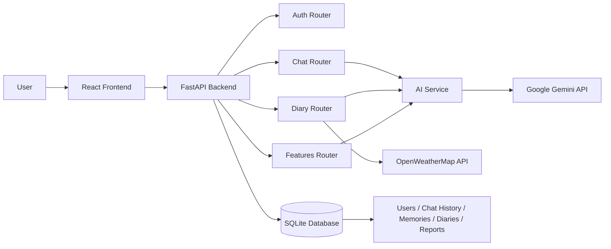
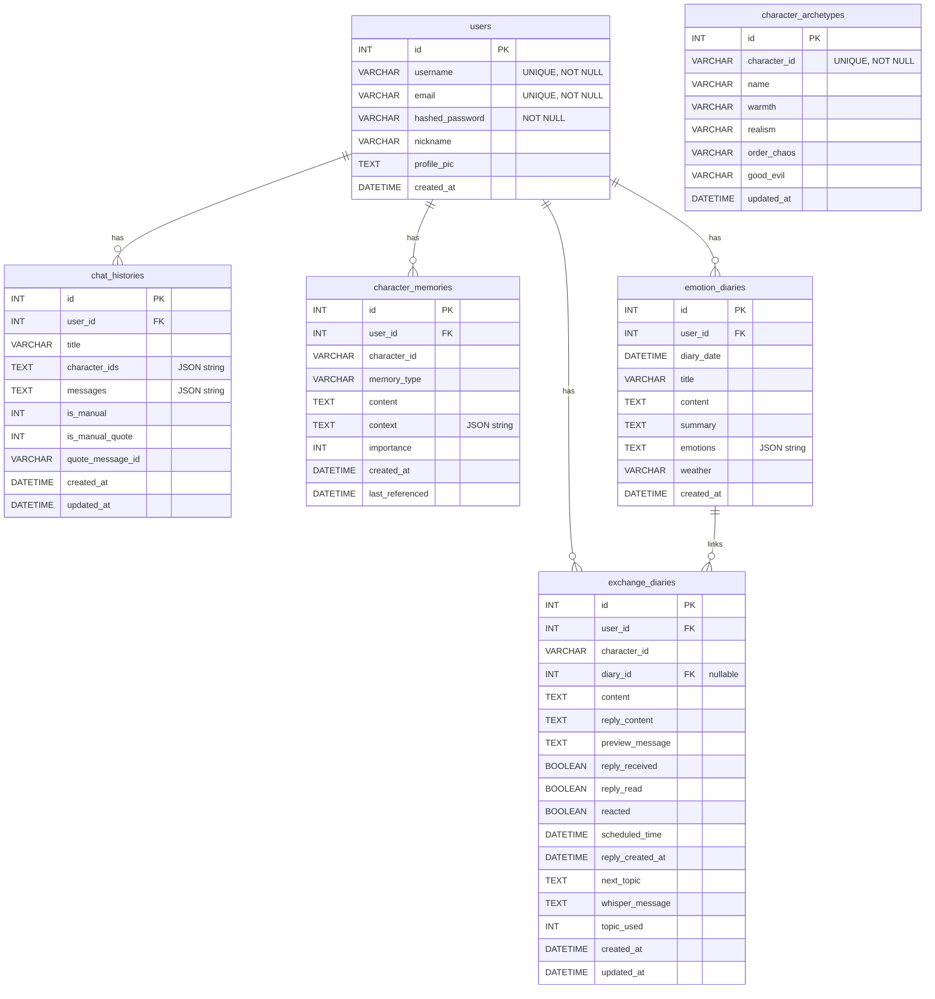
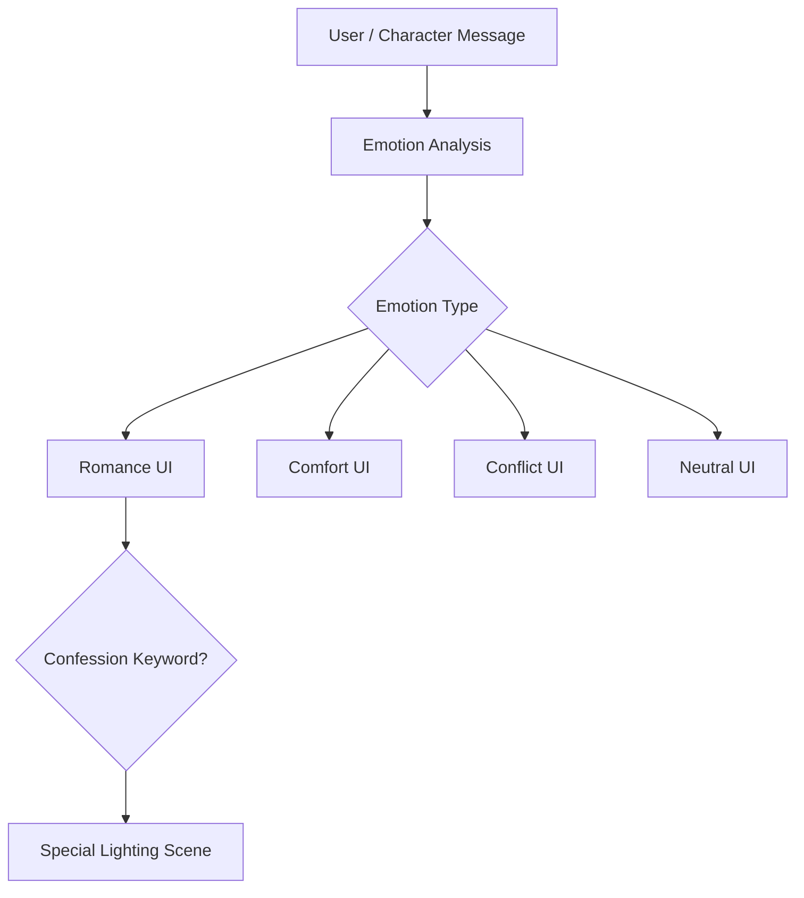

<div align="center">

# IntoDrama
### 드라마가 끝난 뒤에도 캐릭터와의 이야기를 이어가는 AI 페르소나 챗봇

**High-Fidelity Persona Engine · Emotion-aware UI · AI Fan Experience Platform**

<br />

[](https://python.org)
[](https://fastapi.tiangolo.com)
[](https://react.dev)
[](https://ai.google.dev)
[](https://sqlite.org)
[](LICENSE)

<br />

<p>
  <strong>직접 수집한 드라마 명대사와 캐릭터별 말투 데이터를 기반으로</strong><br />
  사용자가 좋아하는 캐릭터와 대화하고, 편지를 주고받고, 감정 기록과 공유 가능한 대사 카드를 남길 수 있도록 설계한
  <strong>AI 캐릭터 챗봇 플랫폼</strong>입니다.
</p>

<br />

</div>

---

## Table of Contents

- [Overview](#overview)
- [Why I Built This](#why-i-built-this)
- [My Contribution & Design Focus](#my-contribution--design-focus)
- [Demo](#demo)
- [Key Features](#key-features)
- [Architecture](#architecture)
- [Tech Stack](#tech-stack)
- [Project Structure](#project-structure)
- [Getting Started](#getting-started)
- [Environment Variables](#environment-variables)
- [API Documentation](#api-documentation)
- [Database Schema](#database-schema)
- [Implementation Details](#implementation-details)
- [Troubleshooting](#troubleshooting)
- [Roadmap](#roadmap)
- [License](#license)
- [Final Note](#final-note)

---

## Overview

**IntoDrama**는 드라마를 좋아하는 사용자가 작품이 끝난 뒤에도 캐릭터와 정서적으로 연결되는 경험을 제공하기 위해 만든 AI 챗봇 서비스입니다.

단순히 “캐릭터 이름을 붙인 챗봇”이 아니라, 각 캐릭터의 말투, 성격, 관계성, 감정 표현 방식이 대화 속에서 자연스럽게 유지되도록 설계했습니다. 사용자는 1:1 채팅, 1:2 멀티채팅, 캐릭터 간 토론, 교환일기, 감정 일기, 심리 리포트, 음악 추천, 캐릭터 성향 지도 등 다양한 방식으로 캐릭터와 상호작용할 수 있습니다.

이 프로젝트는 특정 드라마 캐릭터에만 머무르지 않고, 향후 **역사적 인물 교육용 챗봇**, **웹툰/애니메이션 캐릭터 챗봇**, **정서 기록형 가상 에이전트** 등으로 확장 가능한 **페르소나 기반 AI 챗봇 프레임워크**를 목표로 합니다.

---

## Why I Built This

드라마를 보고 나면 캐릭터와의 감정적 연결이 갑자기 끝나는 순간이 있습니다.  
특히 인상 깊은 인물, 위로가 되었던 대사, 더 듣고 싶었던 이야기가 남아 있을 때 팬들은 자연스럽게 “이 캐릭터와 더 대화해보고 싶다”는 욕구를 느낍니다.

하지만 일반적인 AI 챗봇은 다음과 같은 한계가 있었습니다.

- 캐릭터의 말투와 감정선이 쉽게 무너짐
- 작품 속 관계성과 서사를 충분히 반영하지 못함
- 대화가 단발성으로 끝나 장기적인 관계감이 약함
- 사용자의 감정 변화와 대화 경험이 서비스 전체에 연결되지 않음

IntoDrama는 이 문제를 해결하기 위해, **캐릭터 고증 + 장기 기억 + 감정 기반 UI + 대화 이후의 기록 경험**을 하나의 흐름으로 묶었습니다.  
사용자가 캐릭터와 대화하고, 그 대화가 일기·리포트·음악 추천·공유 가능한 대사 카드로 이어지도록 설계하여, 단순 채팅을 넘어선 **팬 경험의 확장**을 구현하고자 했습니다. 특히 저장된 대사를 이미지로 남기고 공유할 수 있게 하여, 사용자의 감정 기록이 자연스럽게 서비스 홍보 콘텐츠로도 확장될 수 있는 흐름을 고려했습니다.

---

## My Contribution & Design Focus

이 프로젝트에서 가장 중요하게 생각한 부분은 **“AI가 캐릭터처럼 말하는 것”**이 아니라, 사용자가 실제로 그 캐릭터와 관계를 쌓고 있다고 느끼게 만드는 것이었습니다.

### 1. 직접 구축한 캐릭터 페르소나 데이터

캐릭터의 말투와 성격을 자연스럽게 구현하기 위해 드라마 속 명대사와 주요 장면의 표현 방식을 직접 수집·정리했습니다.

- `personas.py`에 약 **2,000줄 규모의 캐릭터 페르소나 데이터** 작성
- 캐릭터별 말투, 어미, 가치관, 감정 표현 방식, 관계성을 수작업으로 정리
- 단순 대사 복사가 아니라, AI가 캐릭터성을 참고할 수 있도록 프롬프트 구조로 재구성
- 파인튜닝 없이도 캐릭터 일관성을 유지할 수 있도록 프롬프트 기반 아키텍처 설계

### 2. 팬 몰입을 고려한 서비스 기획

기능을 단순히 많이 넣는 것이 아니라, 사용자가 캐릭터와 정서적으로 연결되는 흐름을 중심으로 설계했습니다.

- 대화 → 대사 저장 → 이미지 카드 공유 → 감정 일기 → 교환일기 → 심리 리포트로 이어지는 경험 설계
- 캐릭터가 무조건 친절하게 답하지 않고, 원작 성격에 맞게 차갑거나 신중하게 반응하도록 설계
- 캐릭터 간 관계성을 활용한 멀티채팅·토론 모드 구현
- 팬이 “아는 만큼 더 깊게 즐길 수 있는” 대화 구조 기획

### 3. AI 응답 품질을 위한 프롬프트 엔지니어링

각 캐릭터가 단순히 정보를 제공하는 챗봇이 아니라, 작품 속 인물처럼 반응하도록 프롬프트를 설계했습니다.

- 캐릭터 성격, 말투, 관계성, 배경 설정을 분리해 구성
- 대화 상황에 따라 감정 톤과 반응 강도를 조절
- 사용자의 행동 표현 `(웃으며)`, `(한숨 쉬며)` 등을 대화 맥락에 반영
- 현재 날짜·시간대 정보를 자연스럽게 녹여 현실감 있는 대화 제공

### 4. 장기적인 관계감을 위한 기억 시스템

캐릭터와의 관계가 단발성으로 끝나지 않도록, 사용자가 직접 저장한 대화에서 의미 있는 정보를 추출해 다음 대화에 반영했습니다.

- 감정, 사건, 선호도, 관계성 등으로 기억 타입 분류
- 중요도 기반으로 핵심 기억을 우선 참조
- 자동 저장된 모든 대화를 무분별하게 기억하지 않고, 사용자가 직접 저장한 대화만 기억 대상으로 사용
- 토큰 제한을 고려해 필요한 기억만 선별적으로 프롬프트에 주입

### 5. 감정 기반 UX

AI 대화의 몰입감을 높이기 위해 사용자의 감정과 대화 분위기가 UI에 반영되도록 설계했습니다.

- 로맨스, 위로, 갈등, 중립 감정 감지
- 감정에 따라 배경색, 말풍선, 애니메이션 변화
- 고백 키워드 감지 시 조명 효과와 특수 말풍선 연출
- 대화 이후 심리 리포트, 감정 타임라인, 음악 추천으로 연결

---

## Demo

### 전체 데모

[](https://youtube.com/watch?v=vxY2TymhWEs)

### 감정 기반 UI 데모

[](https://youtube.com/watch?v=MmrIpxyqzcE)

### 저장 대사 이미지 카드 데모

저장한 캐릭터 대사를 카드형 이미지로 변환해 갤러리에 저장하거나 공유할 수 있는 기능입니다.  
대화 경험이 앱 안에서 끝나지 않고, 사용자가 직접 보관·공유할 수 있는 팬 콘텐츠이자 자연스러운 홍보 포인트로 확장되도록 고려했습니다.

<p align="center">
  
</p>


---

## Key Features

### High-Fidelity Persona Engine

- 드라마 캐릭터별 말투, 성격, 가치관을 반영한 페르소나 기반 응답
- 직접 수집·정리한 명대사 기반 캐릭터 데이터
- 프롬프트 기반 구조로 캐릭터 확장 가능
- 장기 기억 시스템을 통한 개인화된 관계 형성

### Multi-Character Conversation

- 1:1 캐릭터 채팅
- 1:2 멀티채팅
- 캐릭터 간 관계성을 반영한 상호작용
- 특정 주제에 대해 두 캐릭터가 의견을 나누는 토론 모드
- 사용자가 토론 중간에 개입할 수 있는 참여형 구조

### Emotional Diary & Exchange Letter

- 대화 기반 또는 키워드 기반 감정 일기 생성
- 사용자가 직접 일기 작성 가능
- 일기를 캐릭터에게 보내면 캐릭터가 답장 편지를 작성
- 예약 답장, 답장 우편함, 답장 반응 기능 제공
- 일기 텍스트·이미지 저장 지원

### Conversation Archive & Quote Saving

- 사용자가 직접 저장한 대화만 대화 보관함에 표시
- 마음에 드는 캐릭터 대사를 저장
- 저장된 대사에서 전체 대화 흐름 추적 가능
- 저장된 대사를 카드형 이미지로 변환해 갤러리에 저장하거나 공유 가능
- 사용자가 공유한 대사 카드가 자연스럽게 서비스 홍보 콘텐츠로 확장될 수 있도록 설계
- 자동 저장 데이터와 수동 저장 데이터를 분리해 관리

### Weekly Statistics & Psychology Report

- 주간 대화량, 캐릭터별 활동량, 대화 패턴 분석
- 최근 6개월 주간 리캡 제공
- 로맨스, 위로, 갈등 등 감정 점수 분석
- 키워드, 말투, 관계 패턴 기반 심리 리포트 생성
- 감정 타임라인 시각화

### Emotion-Aware UI

- 대화 내용에 따라 UI 분위기 자동 변화
- 로맨스 / 위로 / 갈등 / 중립 감정 모드
- 감정 강도에 따른 배경색·말풍선·애니메이션 변화
- 고백 장면 감지 시 특수 조명 효과 제공

### Additional UX Features

- 실시간 타이핑 효과
- 메시지 캡처 및 이미지 공유
- 대화 내용을 소설 형식으로 변환
- 한국어 조사 자동 처리
- 캐릭터 검색 및 즐겨찾기
- 음성 입력 및 음성 감정 분석
- 캐릭터 성향 지도
- 감정 기반 음악 추천

---

## Architecture


```mermaid
flowchart LR
  User[User] --> Frontend[React Frontend]
  Frontend --> API[FastAPI Backend]

  API --> Auth[Auth Router]
  API --> Chat[Chat Router]
  API --> Diary[Diary Router]
  API --> Features[Features Router]

  Chat --> AI[AI Service]
  Diary --> AI
  Features --> AI

  AI --> Gemini[Google Gemini API]
  Diary --> Weather[OpenWeatherMap API]

  API --> DB[(SQLite Database)]
  DB --> UserData[Users / Chat History / Memories / Diaries / Reports]
```

### Backend

- FastAPI 기반 REST API 서버
- SQLAlchemy ORM을 통한 데이터 모델 관리
- JWT 기반 인증
- Google Gemini API 연동
- APScheduler 기반 교환일기 예약 답장 처리
- 대화, 일기, 리포트, 음악 추천, 성향 지도 기능을 라우터 단위로 분리

### Frontend

- React 기반 SPA
- 캐릭터 선택, 채팅, 일기, 통계, 리포트, 성향 지도 등 화면 구성
- 감정 기반 UI 상태 관리
- HTML2Canvas를 활용한 대사 카드 및 일기 이미지 저장
- Web Speech API와 Web Audio API를 활용한 음성 입력 및 음성 감정 분석

### Database

- SQLite 기반 로컬 데이터베이스
- 사용자, 대화 기록, 캐릭터 기억, 감정 일기, 교환일기, 캐릭터 성향 데이터 관리
- 자동 저장 데이터와 사용자가 직접 저장한 데이터를 구분하여 서비스 목적에 맞게 활용

---

## Tech Stack

### Backend

| Category | Tech |
|---|---|
| Framework | FastAPI |
| Server | Uvicorn |
| ORM | SQLAlchemy |
| Database | SQLite |
| AI | Google Gemini AI |
| Auth | JWT, Passlib, python-jose |
| Scheduler | APScheduler |
| Environment | python-dotenv |

### Frontend

| Category | Tech |
|---|---|
| Framework | React |
| Chart | Recharts |
| Image Capture | HTML2Canvas |
| Voice Input | Web Speech API |
| Voice Analysis | Web Audio API |
| Styling | CSS Modules / CSS Variables |

### External APIs

| API | Purpose |
|---|---|
| Google Gemini API | 캐릭터 응답 생성, 감정 분석, 리포트 생성 |
| OpenWeatherMap API | 일기 작성 시 날씨 정보 연동 |

---

## Project Structure

```text
IntoDrama/
├── backend/
│   ├── main.py                       # FastAPI 앱 설정 및 라우터 등록
│   ├── database.py                   # 데이터베이스 모델 및 세션 관리
│   ├── auth.py                       # 회원가입, 로그인, JWT 인증
│   ├── chat.py                       # 1:1 채팅, 멀티채팅, 토론, 대화 저장
│   ├── diary.py                      # 감정 일기, 교환일기
│   ├── features.py                   # 성향 지도, 음악 추천, 심리 리포트
│   ├── ai_service.py                 # Gemini API 호출 및 AI 로직
│   ├── personas.py                   # 캐릭터 페르소나 데이터
│   ├── config.py                     # 환경 변수 및 설정
│   ├── models/
│   │   └── schemas.py                # Pydantic 스키마
│   ├── migrations/
│   ├── requirements.txt
│   └── drama_chat.db
│
├── frontend/
│   ├── src/
│   │   ├── components/
│   │   │   ├── CharacterSelectScreen.js
│   │   │   ├── CommonComponents.js
│   │   │   ├── ModalComponents.js
│   │   │   ├── ProfileAndHistoryScreens.js
│   │   │   ├── DebateModal.js
│   │   │   ├── ExchangeDiaryScreen.js
│   │   │   ├── ReportScreens.js
│   │   │   ├── StatsScreen.js
│   │   │   ├── WeeklyRecapScreen.js
│   │   │   └── WeeklyDetailScreen.js
│   │   ├── constants/
│   │   │   ├── characterData.js
│   │   │   ├── chatTemplates.js
│   │   │   └── debateTopics.js
│   │   ├── utils/
│   │   │   ├── api.js
│   │   │   ├── koreanJosa.js
│   │   │   ├── storage.js
│   │   │   ├── text.js
│   │   │   └── reportUtils.js
│   │   ├── App.js
│   │   ├── App.css
│   │   └── index.js
│   ├── public/
│   ├── package.json
│   └── jsconfig.json
│
├── start_all.ps1
├── README.md
├── TECH_STACK.md
├── STRUCTURE_SUMMARY.md
└── requirements.txt
```

---

## Getting Started

### Prerequisites

- Python 3.8+
- Node.js 14+
- npm
- Google Gemini API Key
- OpenWeatherMap API Key, optional

### 1. Clone Repository

```bash
git clone <repository-url>
cd IntoDrama
```

### 2. Backend Setup

```bash
cd backend

python -m venv venv

# Windows PowerShell
.\venv\Scripts\Activate.ps1

# Windows CMD
.\venv\Scripts\activate.bat

# macOS / Linux
source venv/bin/activate

pip install -r requirements.txt
```

Create `backend/.env`.

```env
GOOGLE_API_KEY=your-google-gemini-api-key
WEATHER_API_KEY=your-openweathermap-api-key
SECRET_KEY=your-secret-key
```

Run backend server.

```bash
python main.py
# or
python -m uvicorn main:app --reload
```

The backend server runs at:

```text
http://localhost:8000
```

### 3. Frontend Setup

Open a new terminal.

```bash
cd frontend
npm install
npm start
```

The frontend server runs at:

```text
http://localhost:3000
```

### 4. Run All Servers on Windows

```powershell
.\start_all.ps1
```

---

## Environment Variables

### Backend

| Name | Required | Description |
|---|---:|---|
| `GOOGLE_API_KEY` | Yes | Google Gemini API key |
| `WEATHER_API_KEY` | No | OpenWeatherMap API key for diary weather data |
| `SECRET_KEY` | No | JWT token secret key |

### Frontend

| Name | Required | Description |
|---|---:|---|
| `REACT_APP_API_URL` | No | Backend API URL. Default: `http://localhost:8000` |

---

## API Documentation

After running the backend server:

- Swagger UI: `http://localhost:8000/docs`
- ReDoc: `http://localhost:8000/redoc`

### Main Endpoints

#### Auth

| Method | Endpoint | Description |
|---|---|---|
| `POST` | `/auth/register` | 회원가입 |
| `POST` | `/auth/login` | 로그인 |
| `GET` | `/auth/me` | 현재 사용자 정보 조회 |
| `PUT` | `/auth/profile` | 프로필 수정 |

#### Chat

| Method | Endpoint | Description |
|---|---|---|
| `POST` | `/chat` | 채팅 메시지 전송 |
| `POST` | `/chat/debate` | 토론 시작 및 진행 |
| `POST` | `/chat/save` | 대화 저장 |
| `GET` | `/chat/history` | 저장된 대화 목록 조회 |
| `GET` | `/chat/history/{chat_id}` | 특정 대화 조회 |
| `DELETE` | `/chat/history/{chat_id}` | 대화 삭제 |
| `GET` | `/chat/stats/weekly` | 주간 통계 조회 |
| `GET` | `/chat/stats/weekly-recap` | 주간 리캡 조회 |
| `GET` | `/chat/saved-quotes` | 저장된 대사 목록 조회 |

#### Diary

| Method | Endpoint | Description |
|---|---|---|
| `POST` | `/diary/generate` | 감정 일기 생성 |
| `POST` | `/diary/create` | 일기 직접 작성 |
| `GET` | `/diary/list` | 일기 목록 조회 |
| `GET` | `/diary/{diary_id}` | 특정 일기 조회 |
| `DELETE` | `/diary/{diary_id}` | 일기 삭제 |
| `POST` | `/exchange-diary/create` | 교환일기 생성 |
| `GET` | `/exchange-diary/list` | 교환일기 목록 조회 |
| `GET` | `/exchange-diary/{diary_id}/reply` | 교환일기 답장 조회 |
| `POST` | `/exchange-diary/{diary_id}/react` | 답장 반응 |
| `DELETE` | `/exchange-diary/{diary_id}` | 교환일기 삭제 |
| `GET` | `/exchange-diary/today-topic` | 오늘의 주제 조회 |

#### Features

| Method | Endpoint | Description |
|---|---|---|
| `GET` | `/archetype/map` | 캐릭터 성향 지도 조회 |
| `POST` | `/music/recommend` | 감정 기반 음악 추천 |
| `POST` | `/music/character-recommend` | 캐릭터 음악 추천 |
| `POST` | `/psychology/report` | 심리 리포트 생성 |

---

## Database Schema


```mermaid
erDiagram
  users {
    INT id PK
    VARCHAR username "UNIQUE, NOT NULL"
    VARCHAR email "UNIQUE, NOT NULL"
    VARCHAR hashed_password "NOT NULL"
    VARCHAR nickname
    TEXT profile_pic
    DATETIME created_at
  }

  chat_histories {
    INT id PK
    INT user_id FK
    VARCHAR title
    TEXT character_ids "JSON string"
    TEXT messages "JSON string"
    INT is_manual
    INT is_manual_quote
    VARCHAR quote_message_id
    DATETIME created_at
    DATETIME updated_at
  }

  character_memories {
    INT id PK
    INT user_id FK
    VARCHAR character_id
    VARCHAR memory_type
    TEXT content
    TEXT context "JSON string"
    INT importance
    DATETIME created_at
    DATETIME last_referenced
  }

  emotion_diaries {
    INT id PK
    INT user_id FK
    DATETIME diary_date
    VARCHAR title
    TEXT content
    TEXT summary
    TEXT emotions "JSON string"
    VARCHAR weather
    DATETIME created_at
  }

  exchange_diaries {
    INT id PK
    INT user_id FK
    VARCHAR character_id
    INT diary_id FK "nullable"
    TEXT content
    TEXT reply_content
    TEXT preview_message
    BOOLEAN reply_received
    BOOLEAN reply_read
    BOOLEAN reacted
    DATETIME scheduled_time
    DATETIME reply_created_at
    TEXT next_topic
    TEXT whisper_message
    INT topic_used
    DATETIME created_at
    DATETIME updated_at
  }

  character_archetypes {
    INT id PK
    VARCHAR character_id "UNIQUE, NOT NULL"
    VARCHAR name
    VARCHAR warmth
    VARCHAR realism
    VARCHAR order_chaos
    VARCHAR good_evil
    DATETIME updated_at
  }

  users ||--o{ chat_histories : has
  users ||--o{ character_memories : has
  users ||--o{ emotion_diaries : has
  users ||--o{ exchange_diaries : has
  emotion_diaries ||--o{ exchange_diaries : links
```

---

## Implementation Details

### Persona Prompting Strategy

IntoDrama는 파인튜닝 없이 프롬프트 기반으로 캐릭터성을 구현합니다.

```text
Character Profile
  ├─ 말투와 어미
  ├─ 성격과 가치관
  ├─ 주요 관계성
  ├─ 감정 표현 방식
  ├─ 대표적인 대사 스타일
  └─ 대화 금지/주의 규칙
```

이 구조를 통해 새로운 캐릭터 데이터를 추가하면 기존 엔진을 그대로 사용하면서 다른 캐릭터 챗봇으로 확장할 수 있습니다.

### Memory Policy

모든 대화를 무조건 기억시키지 않고, 사용자가 직접 저장한 대화만 장기 기억 대상으로 사용합니다.

| Save Type | Used for Archive | Used for Memory |
|---|---:|---:|
| Manual conversation save | Yes | Yes |
| Auto-saved conversation | No | No |
| Quote-triggered auto save | No | No |
| Debate mode history | No | No |

이 방식은 사용자의 의도를 반영한 기억만 남기기 위한 설계입니다.

### Emotion Detection Flow


```mermaid
flowchart TD
  Message[User / Character Message] --> Analyze[Emotion Analysis]
  Analyze --> Type{Emotion Type}
  Type --> Romance[Romance UI]
  Type --> Comfort[Comfort UI]
  Type --> Conflict[Conflict UI]
  Type --> Neutral[Neutral UI]
  Romance --> Confession{Confession Keyword?}
  Confession --> Special[Special Lighting Scene]
```

---

## Troubleshooting

### Backend server does not start

- Python 가상환경이 활성화되어 있는지 확인
- `requirements.txt` 의존성이 모두 설치되었는지 확인
- `GOOGLE_API_KEY`가 설정되어 있는지 확인
- 포트 `8000`이 이미 사용 중인지 확인

### Frontend cannot connect to backend

- 백엔드 서버가 `http://localhost:8000`에서 실행 중인지 확인
- `REACT_APP_API_URL` 설정 확인
- 브라우저 콘솔의 CORS 오류 확인

### Gemini API location error

If you see an error such as:

```text
400 User location is not supported for the API use
```

Possible solutions:

- Gemini API를 지원하는 지역에서 API 키를 발급했는지 확인
- Google AI Studio의 API 키 설정 확인
- 지원 지역의 네트워크 환경에서 테스트
- 필요 시 프록시 또는 대체 API 연동 구조 검토

### Voice input does not work

- Chrome 또는 Edge 최신 버전 사용 권장
- 마이크 권한 허용 여부 확인
- HTTPS 환경에서 테스트 권장

---

## Roadmap

- 캐릭터 데이터 추가를 위한 관리자 도구
- 캐릭터 페르소나 템플릿 자동 생성 기능
- RAG 기반 캐릭터 설정 검색 기능
- 감정 분석 모델 고도화
- 대화 리포트 공유 페이지
- 모바일 PWA 최적화
- 사용자별 캐릭터 관계 성장 시스템

---

## License

This project is licensed under the MIT License.

### Open Source Libraries

#### Backend

- FastAPI: MIT
- Uvicorn: BSD-3-Clause
- SQLAlchemy: MIT
- Pydantic: MIT
- python-jose: MIT
- passlib: BSD-3-Clause
- google-generativeai: Apache-2.0
- APScheduler: MIT
- python-dotenv: BSD-3-Clause

#### Frontend

- React: MIT
- react-scripts: MIT
- html2canvas: MIT
- Recharts: MIT
- Testing Library: MIT
- web-vitals: Apache-2.0

### External Services

- Google Gemini API: Google API Terms of Service
- OpenWeatherMap API: OpenWeatherMap Terms of Service

> 캐릭터, 작품명, 대사 등 제3자 저작물과 관련된 요소를 활용할 경우, 배포 및 상업적 이용 시 관련 권리와 플랫폼 정책을 반드시 확인해야 합니다.

---

## Final Note

IntoDrama는 기술적으로는 AI 챗봇 프로젝트이지만, 기획적으로는 **팬이 캐릭터와의 감정을 이어갈 수 있는 경험**을 만드는 데 초점을 둔 프로젝트입니다.

이 프로젝트에서 가장 큰 도전은 “AI 응답을 만드는 것”이 아니라, 사용자가 캐릭터의 말투, 감정선, 관계성을 실제로 느낄 수 있도록 **데이터를 직접 수집하고, 페르소나를 설계하고, 대화 이후의 경험까지 연결하는 것**이었습니다.

IntoDrama는 하나의 드라마 팬 서비스에서 출발했지만, 페르소나 데이터만 교체하면 다양한 인물형 AI 서비스로 확장할 수 있는 구조를 지향합니다.
